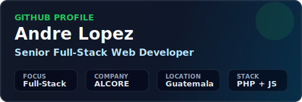
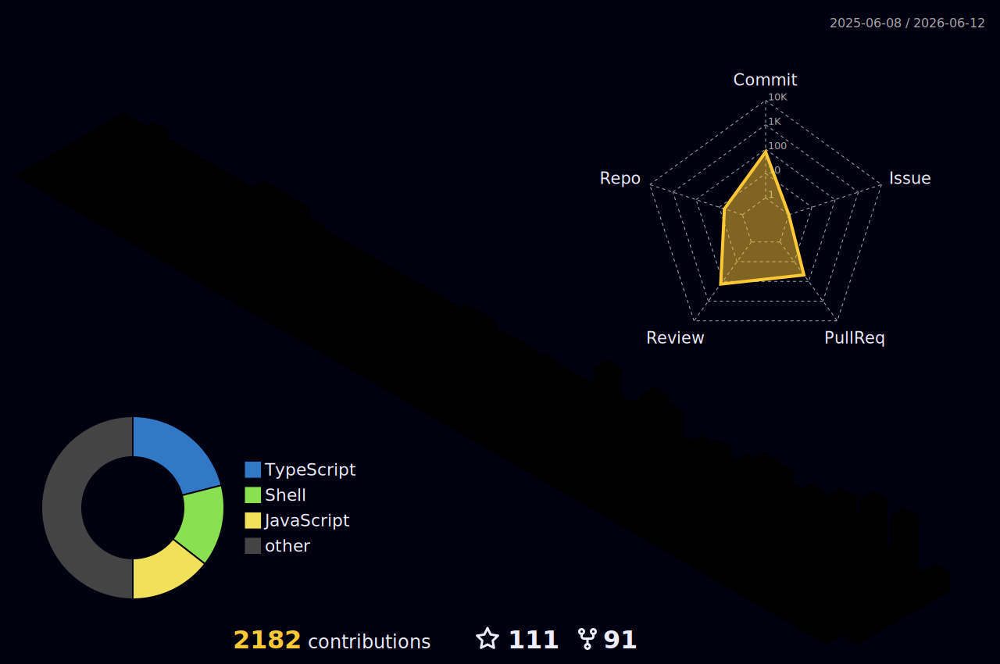

<div align="center">
  
</div>

<br />

<div align="center">
  <a href="https://alcore-gt.com/">
    
  </a>
  <a href="https://github.com/anndreloopez012?tab=repositories">
    
  </a>
  
</div>

<h1 align="center">Hola, soy Andre Lopez</h1>

<p align="center">
  <strong>Full-Stack Developer | Software, Cloud, Data, Security & Business Solutions</strong>
  <br />
  Desarrollo aplicaciones, plataformas web, integraciones, infraestructura cloud y soluciones tecnicas para empresas que necesitan operar mejor, vender mejor y escalar con tecnologia.
</p>

<div align="center">
  <a href="https://github.com/anndreloopez012">
    
  </a>
</div>

---

## Que hago

<table>
  <tr>
    <td width="50%">
      <h3>Desarrollo de software</h3>
      <p>Construyo aplicaciones web, sistemas internos, plataformas administrativas, APIs, integraciones y productos digitales usando PHP, React, JavaScript, TypeScript, Node.js y ReactJS.</p>
    </td>
    <td width="50%">
      <h3>Aplicaciones moviles</h3>
      <p>Desarrollo soluciones moviles con Capacitor, conectadas a APIs, bases de datos, servicios cloud y paneles administrativos.</p>
    </td>
  </tr>
  <tr>
    <td width="50%">
      <h3>Cloud, redes e infraestructura</h3>
      <p>Vendo, configuro y acompano servicios cloud, despliegues, dominios, DNS, servidores, infraestructura de red, seguridad y montaje de aplicaciones.</p>
    </td>
    <td width="50%">
      <h3>Consultoria para empresas</h3>
      <p>Doy asesorias, conferencias y acompanamiento sobre software, sistemas de terceros, automatizacion, seguridad informatica y soluciones orientadas a operacion empresarial.</p>
    </td>
  </tr>
</table>

---

## Stack principal

<div align="center">
  
</div>

<br />

<div align="center">
  
  
  
  
  
  
</div>

---

## Areas de experiencia

<table>
  <tr>
    <td width="33%">
      <h3>Web & Apps</h3>
      <ul>
        <li>PHP y arquitecturas backend</li>
        <li>React, ReactJS y TypeScript</li>
        <li>Node.js y APIs</li>
        <li>Aplicaciones moviles con Capacitor</li>
      </ul>
    </td>
    <td width="33%">
      <h3>Datos & Plataformas</h3>
      <ul>
        <li>MySQL, PostgreSQL, Oracle y SQL Server</li>
        <li>MongoDB y bases NoSQL</li>
        <li>Supabase y Strapi</li>
        <li>Big Data, consultas y modelado de informacion</li>
      </ul>
    </td>
    <td width="33%">
      <h3>Infraestructura & Seguridad</h3>
      <ul>
        <li>Cloud services y montaje de aplicaciones</li>
        <li>Servidores, DNS, redes y despliegues</li>
        <li>Seguridad informatica</li>
        <li>Revision de riesgos y buenas practicas</li>
      </ul>
    </td>
  </tr>
</table>

---

## Asesorias y conferencias

Trabajo con empresas y equipos que necesitan convertir problemas operativos en soluciones tecnicas claras.

- Asesoria en desarrollo de software y arquitectura de sistemas.
- Evaluacion y mejora de aplicaciones existentes.
- Asesoria sobre sistemas de terceros, integraciones y adopcion tecnologica.
- Conferencias sobre soluciones digitales, automatizacion, cloud, seguridad y modernizacion empresarial.
- Acompanamiento en venta, configuracion y puesta en marcha de cloud services.
- Montaje de aplicaciones, infraestructura de red, dominios, DNS y ambientes productivos.

---

## Proyectos educativos

<table>
  <tr>
    <td width="50%">
      <h3>Campuslands Devs</h3>
      <p>Creo repositorios educativos por niveles para que estudiantes aprendan logica, Git, JavaScript, TypeScript, PHP, SQL, MongoDB, Node.js, Express y buenas practicas de desarrollo con ejercicios progresivos.</p>
    </td>
    <td width="50%">
      <h3>Mentoria practica</h3>
      <p>Me enfoco en que los estudiantes aprendan haciendo: estructura real de proyectos, flujo profesional con ramas, Pull Requests, feedback y revision tecnica.</p>
    </td>
  </tr>
</table>

## Actividad en vivo

<div align="center">
  
  
</div>

<div align="center">
  
</div>

<div align="center">
  
</div>

---

## Tarjetas automaticas

<div align="center">
  
  
  
  
  
</div>

---

## Como trabajo

```txt
Problema -> diagnostico -> arquitectura -> desarrollo -> despliegue -> seguridad -> mejora continua
```

<table>
  <tr>
    <td>Arquitectura simple</td>
    <td>Prefiero sistemas faciles de mantener, con estructura limpia y decisiones tecnicas justificadas.</td>
  </tr>
  <tr>
    <td>Entrega real</td>
    <td>No solo construyo pantallas: conecto APIs, bases de datos, dominios, cloud, redes, seguridad, despliegues y automatizaciones.</td>
  </tr>
  <tr>
    <td>Vision empresarial</td>
    <td>Analizo tecnologia desde el impacto en ventas, operacion, costos, seguridad, continuidad y crecimiento.</td>
  </tr>
  <tr>
    <td>Mejora continua</td>
    <td>Actualizo procesos, documento soluciones y convierto problemas repetidos en herramientas reutilizables.</td>
  </tr>
</table>

---

## Contacto

<div align="center">
  <a href="https://alcore-gt.com/">
    
  </a>
  <a href="https://github.com/anndreloopez012">
    
  </a>
</div>

<br />

<div align="center">
  <strong>Disponible para desarrollo de software, consultoria tecnica, cloud services, infraestructura, seguridad y soluciones digitales para empresas.</strong>
</div>
