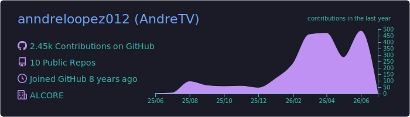
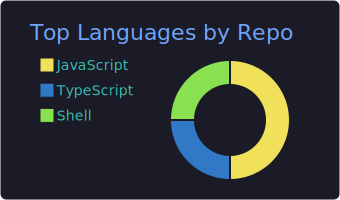
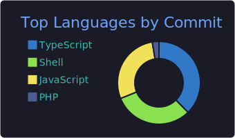
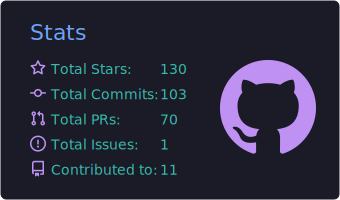
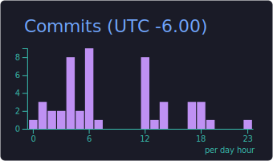

<div align="center">
  
</div>

<br />

<div align="center">
  <a href="https://alcore-gt.com/">
    
  </a>
  <a href="https://github.com/anndreloopez012?tab=repositories">
    
  </a>
  
</div>

<h1 align="center">Hola, soy Andre Lopez</h1>

<p align="center">
  <strong>Senior Web Developer | Full-Stack PHP, JavaScript, TypeScript y React</strong>
  <br />
  Construyo soluciones web a medida, automatizaciones, productos digitales, experiencias educativas y herramientas listas para produccion desde Guatemala.
</p>

<div align="center">
  <a href="https://github.com/anndreloopez012">
    
  </a>
</div>

---

## En que estoy trabajando ahora

<table>
  <tr>
    <td width="50%">
      <h3>ALCORE</h3>
      <p>Desarrollo soluciones web profesionales, integraciones, infraestructura y herramientas digitales para negocios que necesitan velocidad, estabilidad y presencia online real.</p>
    </td>
    <td width="50%">
      <h3>Campuslands Devs</h3>
      <p>Creo ejercicios practicos por fases para ensenar desarrollo, estructura de proyectos, Git profesional y JavaScript a estudiantes de informatica.</p>
    </td>
  </tr>
  <tr>
    <td width="50%">
      <h3>Automatizacion e infraestructura</h3>
      <p>Trabajo con DNS, Cloudflare, correo, despliegues, documentacion tecnica y flujos que reducen trabajo manual.</p>
    </td>
    <td width="50%">
      <h3>Producto y experiencia</h3>
      <p>Me enfoco en interfaces claras, rendimiento, buenas practicas y soluciones que se puedan mantener en el tiempo.</p>
    </td>
  </tr>
</table>

---

## Stack principal

<div align="center">
  
</div>

<br />

<div align="center">
  
  
  
  
</div>

---

## Proyectos destacados

<div align="center">
  <a href="https://github.com/anndreloopez012/campuslands-devs">
    
  </a>
  <a href="https://github.com/anndreloopez012/campuslands-devs-javascript">
    
  </a>
</div>

---

## Actividad en vivo

<div align="center">
  
  
</div>

<div align="center">
  
</div>

<div align="center">
  
</div>

---

## Tarjetas automaticas

<div align="center">
  
  
  
  
  
</div>

---

## Como trabajo

```txt
Idea -> arquitectura clara -> desarrollo rapido -> pruebas -> deploy -> medicion -> mejora continua
```

<table>
  <tr>
    <td>Arquitectura simple</td>
    <td>Prefiero sistemas faciles de mantener, con estructura limpia y decisiones tecnicas justificadas.</td>
  </tr>
  <tr>
    <td>Entrega real</td>
    <td>No solo construyo pantallas: conecto APIs, dominios, correo, hosting, seguridad y automatizaciones.</td>
  </tr>
  <tr>
    <td>Educacion tecnica</td>
    <td>Creo material practico para que otros aprendan haciendo, usando Git, JavaScript y proyectos reales.</td>
  </tr>
  <tr>
    <td>Mejora continua</td>
    <td>Actualizo procesos, documento soluciones y convierto problemas repetidos en herramientas reutilizables.</td>
  </tr>
</table>

---

## Contacto

<div align="center">
  <a href="https://alcore-gt.com/">
    
  </a>
  <a href="https://github.com/anndreloopez012">
    
  </a>
</div>

<br />

<div align="center">
  <strong>Disponible para proyectos web, automatizacion, infraestructura y soluciones digitales a medida.</strong>
</div>
